<!-- START doctoc generated TOC please keep comment here to allow auto update -->
<!-- DON'T EDIT THIS SECTION, INSTEAD RE-RUN doctoc TO UPDATE -->
**Table of Contents**  *generated with [DocToc](https://github.com/thlorenz/doctoc)*

- [Handling security issues for Apache Airflow](#handling-security-issues-for-apache-airflow)
- [Label lifecycle](#label-lifecycle)
- [Roles and responsibilities](#roles-and-responsibilities)

<!-- END doctoc generated TOC please keep comment here to allow auto update -->

## Handling security issues for Apache Airflow

We keep all security issues reported for Apache Airflow in this separate repository. This repository is
private, and only members of the security team have access to it.

The issues here are created from reports raised via the `security@airflow.apache.org` mailing list
and copied here by members of the security team.

Note that at various points we respond to the reporter with information about our assessment
of the issue. We use [canned responses](canned-responses.md) to handle some common cases, so
consult them if you need to send a response.

### Keeping the reporter informed

The security team commits to keeping the original reporter informed about the state of their report
**at every status transition**, on the original mail thread (not on the GitHub-notifications mirror
thread). A short status update should be sent to the reporter whenever any of the following happens:

* the report has been acknowledged or assessed (valid / invalid);
* a CVE has been allocated;
* a fix PR has been opened;
* a fix PR has been **merged**;
* the issue has been scheduled for a specific release (milestone set);
* the release has shipped and the public advisory has been sent;
* any credits or fields visible in the eventual public advisory have changed.

Each status update should plainly state what has changed, link to the relevant artifact (PR URL,
CVE ID, advisory link), and state what comes next. If the reporter has not yet replied with their
preferred credit, ask the credit-preference question — but **do not re-ask it if it has already
been asked** on the same thread and is still awaiting a reply. Pinging the reporter twice about the
same open question is rude and gets us blocklisted; default to the reporter's full name from the
original email if they do not respond before publication.

**Every status transition must also be recorded as a comment on the GitHub issue in
`airflow-s/airflow-s`**, not only sent by email. The two channels serve different audiences: the
email keeps the reporter informed; the issue comment keeps the rest of the security team and the
release manager informed without forcing them to reconstruct the state from labels and timestamps.
The comment should briefly state what changed, link to the artifact (PR URL, CVE ID, advisory
link), and indicate whether the reporter has been notified.

Note that the **author of the GitHub issue is not always the reporter**: security team members
routinely copy reports from the mailing list into GitHub issues, so the GitHub author is the
team member who copied it, while the real reporter is whoever sent the original email to
`security@airflow.apache.org`. Always identify the real reporter from the original mail thread
before sending a status update.

The process of handling an issue is as follows:

1) The reporter reports the issue to `security@airflow.apache.org` or `security@apache.org` (in the latter
   case, the security team of the Apache Software Foundation will forward the issue to the Airflow security
   mailing list).

2) **Import the report into `airflow-s/airflow-s` as a tracking issue.** The
   [`import-security-issue`](.claude/skills/import-security-issue/SKILL.md)
   skill is the on-ramp of the process: it scans `security@airflow.apache.org` for threads that have not
   yet been imported, classifies each candidate (real report vs. automated-scan / consolidated / media /
   spam), extracts the issue-template fields from the root message, and proposes one tracker per valid
   report plus a receipt-of-confirmation Gmail draft for each. Nothing is applied without explicit user
   confirmation. A security team member runs the skill (*"import new reports"*) as the first action of
   a triage sweep; the newly-created issue lands with the `needs triage` label set automatically by
   the issue template, and the draft reply is ready in Gmail for the triager to review and send.

   If the report is "obviously invalid" (we've seen such issues before and triaged or responded to them)
   — for example an automated-scanner dump or a consolidated multi-issue report — the skill proposes the
   matching canned response from [`canned-responses.md`](canned-responses.md) as a Gmail draft and does
   **not** create a tracker, so the invalid class never enters the board.

   The tracker still has no scope label at this point — that is applied at Step 5 when validity is
   confirmed.

3) In the issue, we discuss and agree on whether it is worth having a CVE for it.

4) If the discussion stalls and we cannot make a decision in about 30 days, the next step
   is to seek assistance in making a decision from a broader audience:
   * `private@airflow.apache.org`
   * `security@apache.org`
   * the reporter(s) who raised the issue, asking them for their opinion and additional context

   Such a discussion should include additional context — a digest of the discussion so far, the options
   considered, the impact, pros and cons, and so on. This can help to get additional perspectives and
   possibly better ideas.

5) Finally, if we cannot reach consensus we follow [voting](https://www.apache.org/foundation/voting.html#apache-voting-process).
   A vote on code modification is used, which means that committers have binding votes, whereas everyone
   else has advisory votes — and all are encouraged to vote and express their opinion. If there is no major
   disagreement during the discussion, there is no need to formally vote via a mailing list thread — the
   voting is done in the PR. However, if there are differing opinions, voting is done on the
   `security@airflow.apache.org` list. The `needs triage` label should then be removed.

6) If we agree the issue is invalid, a team member closes the issue and responds to the reporter with
   that information. If the issue is valid, the team member [assigns a CVE via the ASF CVE tool](https://cveprocess.apache.org/allocatecve).
   The team member then responds in the email thread to confirm creation of the CVE to the reporter, including
   the CVE ID, asks the reporter how they would like to be credited, and updates the reporter name in the
   issue description when the reporter answers.

7) One of the team members self-assigns the issue (not necessarily the person who originally started
   the discussion) and implements the fix.

   NOTE: In some cases it is possible to delegate the fix to a trusted third-party individual. For example, if
   the security team member assigned to the issue has access to developers willing or otherwise dedicated to
   Airflow development, they may delegate to one such individual, provided that:
   1) The individual is trusted.
   2) The individual only receives the information required to implement a fix (no wholesale sharing of
      security team emails, GitHub issues, etc.).
   3) A LAZY CONSENSUS vote is conducted in either the email thread or the GitHub issue associated with the
      security issue (GitHub communications are synced to the email group for posterity).

8) If the issue is straightforward, it may be followed by a direct PR in the Airflow repository. The
   description in the PR should not reveal the CVE or the security nature of it.

9) In exceptional cases — when the issue is highly critical, or when code discussion is needed and the PR
   requires input and review before it gets merged — the person solving it can create a PR in the
   `airflow-s/airflow-s` repository with "Closes: #issue". The PR should be raised against the `main` branch
   of the `airflow-s/airflow-s` repository (not the default `airflow-s` branch). This allows for detailed
   code-change discussion in private. For now, CI is not run for PRs in the `airflow-s/airflow-s` repository,
   so static checks and tests should be run manually by the person creating the PR. We may improve this in
   the future. Once the PR has been reviewed, approved, and is ready to merge, the branch with the fix should
   be pushed to the Airflow repository and the PR should be re-opened in the Airflow repository by pushing
   the branch to public `apache/airflow` and merging it there.

10) Once the PR is created in the `apache/airflow` repository, the team member who creates it should
    link to the PR in the description of the issue and mark the issue with the `pr created` label in
    `airflow-s`.

11) **PR merged.** When the `apache/airflow` PR merges, the security team member merging it should
    move the issue from `pr created` to `pr merged`. If there is a private variant of the PR in the
    `airflow-s/airflow-s` repository, it should be closed. The milestone of the issue should be set
    to the milestone when it is planned to be released. Milestones follow these formats:

    * **`Airflow-X.Y.Z`** — core Airflow releases (e.g. `Airflow-2.6.2`, `3.2.2`).
    * **`Providers YYYY-MM-DD`** — provider-wave cuts, keyed by the cut date listed on the
      [Release Plan wiki](https://cwiki.apache.org/confluence/display/AIRFLOW/Release+Plan). The
      cut date, not the publish date on PyPI, is used as the milestone title.
    * **`Chart-X.Y.Z`** — Airflow Helm Chart releases (e.g. `Chart-1.9.0`).

    New milestones are created when needed. The `sync-security-issue` skill will create a missing
    provider-wave milestone via `gh api` and assign the issue to it in the same proposal.
    Sometimes, as a result of the triage discussions, the fix should not be applied in the next
    patch-level release — for example, because of high risk involved or because it needs to be
    correlated with other changes. In such cases, the milestone in the issue and the corresponding PR
    should be set to the next minor release rather than the next patch-level release.

    **The issue stays at `pr merged` until the release containing the fix actually ships.** That
    may be hours (for core patch releases cut on a fast cadence) or weeks (for providers waves on
    a fixed monthly schedule). During that window the issue is waiting on the release train, not
    on any action from the security team — the next transition fires automatically when the
    release hits PyPI / the Helm registry (Step 12).

12) **Fix released.** When the release carrying the fix actually ships to users — the final
    `apache/airflow` / `apache-airflow-providers-*` / `apache-airflow-helm-chart-*` version is live
    on PyPI or on the Helm registry — the issue moves from `pr merged` to `fix released`. The
    `sync-security-issue` skill detects the release (by curling PyPI / the Helm registry for the
    milestone version) and proposes the label swap on the next run, so in practice this transition
    is automatic; a security team member only needs to confirm the sync proposal.

    **Why this is its own step.** The `pr merged` → `fix released` swap is the cue that ownership
    of the issue has transferred from the fix author / triager to the **release manager** for that
    release. Before `fix released`, the issue is a code-change artifact; after `fix released`, it
    is an advisory-coordination artifact and the release manager is responsible for steps 13–15
    below. Combining the two into one step made this ownership hand-off implicit; splitting them
    makes it explicit and surfaces an `fix released` backlog the release manager can drive from
    the board.

13) During releases, the release manager looks through `fix released` issues in `airflow-s`
    (historically marked `Not yet announced` — the new `fix released` label is the preferred
    form), updates the [ASF CVE tool](https://cveprocess.apache.org), and updates the following
    fields, taking them from the issue:

    * CWE (Common Weakness Enumeration) — possible CWEs are available [here](https://cwe.mitre.org/data/index.html)
    * Product name (Airflow, affected Airflow Provider, or Airflow Helm Chart)
    * Version affected (`0, < Version released`)
    * Short public summary
    * Severity score — based on the [Severity Rating blog post](https://security.apache.org/blog/severityrating).
      The issue owner should, during discussion on the issue, propose the score and update the ticket.
      In obvious cases with no objections, this should work in lazy-consensus mode. If there are differing
      opinions, driving the discussion to achieve consensus is the preferred outcome. Voting may be cast if
      needed. If the severity has not been decided or consensus reached during earlier discussion, the
      Release Manager has the final say on the severity score (but should take into account the opinions of
      the security team). This is to prioritize getting the issue announcement out in a timely manner.
    * References:
        * `patch` — PR to the fix in the Apache Airflow repository
    * Credits:
        * `reporter` — reporter(s) of the issue
        * `remediation developer` — PR author(s)

    The release manager also generates the CVE description, sets the CVE to REVIEW if feedback is needed and
    then to READY, and eventually sends the announcement emails from the ASF CVE tool. The release manager
    then adds the `announced - emails sent` label and removes the `fix released` label. **The issue stays
    open** at this point — it is closed only at Step 15 below, after the public archive URL has been
    captured (Step 14) and the CVE record has been pushed to PUBLISHED in Vulnogram (Step 15). This
    gives the `sync-security-issue` skill one more handoff where it can notice a missing archive URL
    and prompt for it before the issue is forgotten.

14) **Capture the public advisory URL and move the tracker to `vendor-advisory ready`.** Once the
    announcement email has been delivered and archived, this is done by the next
    `sync-security-issue` run (or the release manager, if they want to drive it by hand):

    * retrieves the archive URL from the
      [users@ list archive](https://lists.apache.org/list.html?users@airflow.apache.org) — the
      `sync-security-issue` skill scans the archive for the CVE ID on every run and proposes the URL
      automatically once it finds a match;
    * pastes the URL into the tracking issue's **Public advisory URL** body field (the field was added
      to the issue template specifically for this handoff — never reuse the *"Security mailing list
      thread"* field, which holds the private `security@` thread);
    * regenerates the CVE JSON attachment — `generate-cve-json` now picks up the URL from the body
      automatically and tags it as `vendor-advisory` in `references[]`, so the attached CVE record
      carries a resolvable `vendor-advisory` link ready to paste into the ASF CVE tool;
    * **adds the `vendor-advisory ready` label** to the tracking issue. The issue **stays open** at
      this point — closing is the release manager's job in Step 15 below, after they have pushed the
      CVE record to PUBLISHED in Vulnogram.

    Until the *Public advisory URL* field is populated, the `sync-security-issue` skill will not
    propose moving the issue to `vendor-advisory ready` — this is deliberate: the field is what the
    CVE record's public `vendor-advisory` reference will point at, and publishing a CVE with an empty
    reference leaks a broken record into `cve.org`.

15) **Push the final CVE record and close the issue.** For every issue carrying the
    `vendor-advisory ready` label, the release manager (the same person who sent the advisory in
    Step 13):

    * opens the Vulnogram `#source` tab at `https://cveprocess.apache.org/cve5/<CVE-ID>#source`;
    * copies the latest CVE JSON attachment from the tracking issue (the one regenerated in Step 14,
      now carrying the `vendor-advisory` URL) and pastes it into the `#source` form;
    * saves and moves the record from `REVIEW` to `PUBLISHED` in the ASF CVE tool — **this is the
      final action** that propagates the record to [`cve.org`](https://cve.org);
    * adds the `vendor-advisory` label to the tracking issue, removes the `vendor-advisory ready`
      label, and **closes the issue**. That closes the lifecycle.

    This two-step hand-off (sync captures the URL → RM publishes the record) means nobody has to
    remember both halves: the sync skill's responsibility ends when the label is `vendor-advisory
    ready`, and the RM's responsibility is scoped to taking a `vendor-advisory ready` issue to the
    closed state. An issue that sits on `vendor-advisory ready` for more than a day or two is a
    signal to ping the RM.

16) If we need to add missing credits (which sometimes happens due to copy-and-paste errors and the
    brittleness of the process), the release manager:
    * responds to the announcement emails and mentions the missing credits
    * updates the [ASF CVE tool](https://cveprocess.apache.org) with the missing credits
    * asks the ASF security team to push the information to [cve.org](https://cve.org)

## Label lifecycle

The diagram below shows the typical state flow. Each node is a label (or a cluster of labels that
co-exist); each edge is a process step that moves the issue forward. Closing dispositions
(`invalid`, `not CVE worthy`, `duplicate`, `wontfix`) can terminate the flow at any point after
`needs triage`.

```mermaid
flowchart LR
    A([report on security@]) -->|step 2: import-security-issue| B[needs triage]
    B -->|step 5: consensus invalid| X1([invalid / not CVE worthy / duplicate / wontfix])
    B -->|step 5: consensus valid| C[airflow / providers / chart]
    C -->|step 6: CVE reserved| D[cve allocated]
    D -->|step 10: public PR opened| E[pr created]
    E -->|step 11: PR merges| F[pr merged]
    F -->|step 12: release ships| G[fix released]
    G -->|step 13: advisory sent| H[announced - emails sent]
    H -->|step 14: archive URL captured| J[vendor-advisory ready]
    J -->|step 15: RM pushes CVE PUBLISHED| I[vendor-advisory]
    I -->|step 15: close| Z([issue closed])

    classDef closed fill:#f8d7da,stroke:#842029,color:#000;
    classDef done fill:#d1e7dd,stroke:#0f5132,color:#000;
    class X1,Z closed;
    class H,J,I done;
```

The table below repeats the same flow in tabular form. An issue typically moves through these
labels left-to-right:

| Label | Meaning | Added at step | Removed at step |
| --- | --- | --- | --- |
| `needs triage` | Freshly filed; assessment not yet started. | 1 | 5 |
| `airflow` / `providers` / `chart` | Scope of the vulnerability. Exactly one of these is set. | 5 | never (sticks for the lifetime of the issue) |
| `cve allocated` | A CVE has been reserved for the issue. | 6 | never |
| `pr created` | A public fix PR has been opened in `apache/airflow` but has not yet merged. | 10 | 11 (replaced by `pr merged`) |
| `pr merged` | The fix PR has merged into `apache/airflow`; no release with the fix has shipped yet. | 11 | 12 (replaced by `fix released` when the release ships) |
| `fix released` | A release containing the fix has shipped to users; advisory has not been sent yet. | 12 | 13 (replaced by `announced - emails sent`) |
| `announced - emails sent` | The public advisory has been sent to `announce@apache.org` / `users@airflow.apache.org`. The issue **stays open** after this label is applied; closing is gated on `vendor-advisory` being set in Step 15. | 13 | never (stays on the issue after closing for audit history) |
| `Not yet announced` | **Legacy** synonym of `fix released`. New issues should use `fix released`; existing `Not yet announced` labels are still honoured by the skills during sync. | — | — |
| `vendor-advisory ready` | The public advisory URL has been captured in the tracking issue's *Public advisory URL* body field and the attached CVE JSON has been regenerated so its `references[]` now carries the `vendor-advisory` URL. The tracking issue is waiting for the release manager to paste the CVE JSON into Vulnogram's `#source` tab, move the record to PUBLISHED, and close the issue (Step 15). | 14 | 15 (replaced by `vendor-advisory`) |
| `vendor-advisory` | The release manager has pushed the CVE record to PUBLISHED in the ASF CVE tool and closed the tracking issue. This is the terminal state of the lifecycle. | 15 | never |
| `wontfix` / `invalid` / `not CVE worthy` / `duplicate` | Closing dispositions for reports that are not valid or not CVE-worthy. | 5 / 6 | — |

The [`sync-security-issue`](.claude/skills/sync-security-issue/SKILL.md) skill keeps these labels
honest: on every run it detects the current state of the issue, the fix PR, and the release train,
and proposes the label transitions the process requires.

## Roles and responsibilities

Three roles share this process. Any security-team member can take on any of them for a given
issue, and in practice people rotate, but at any moment a given tracking issue has exactly one
person who owns the next move. These sections describe what each role owns and which tools
they should use.

### Issue triager

Owns **Steps 1–6**: from an inbound report on `security@airflow.apache.org` to a CVE allocation.

What a triager does:

- Runs [`import-security-issue`](.claude/skills/import-security-issue/SKILL.md) at the start of
  a triage sweep to scan `security@airflow.apache.org` for reports not yet imported. The skill
  classifies candidates (real report vs. automated-scan / consolidated / media / spam),
  extracts the issue-template fields from the root email, and proposes one tracker per valid
  report plus a receipt-of-confirmation Gmail draft for each — all behind a single
  user-confirmation step.
- Reviews and sends the confirmation-of-receipt reply that `import-security-issue` drafted from
  [`canned-responses.md`](canned-responses.md), **including the credit-preference question**, so
  the reporter's credit form is on record before the fix lands.
- Drives the valid / invalid / not-CVE-worthy assessment in the tracking-issue comments, pulling
  at least one other security-team member into the discussion. Uses the canned-response templates
  for negative assessments so the tone stays polite-but-firm.
- Applies exactly one scope label (`airflow` / `providers` / `chart`) when the report is confirmed
  valid; splits into per-scope trackers when a report affects more than one scope (the
  `sync-security-issue` skill surfaces this as a blocker).
- Allocates the CVE via the [ASF CVE tool](https://cveprocess.apache.org/allocatecve) and pastes
  the tool link into the body's *CVE tool link* field — this adds the `cve allocated` label.

Tools a triager uses most:

- [`import-security-issue`](.claude/skills/import-security-issue/SKILL.md) — *"import new
  reports"* at the start of each triage sweep. Converts un-tracked `security@` threads into
  `airflow-s/airflow-s` trackers and drafts the first reply. This is the entry point into the
  process — every other tool runs on the trackers this one creates.
- [`sync-security-issue`](.claude/skills/sync-security-issue/SKILL.md) — *"sync \<issue-ref\>"* or
  *"sync all"* for a triage sweep. Surfaces stalled issues, missing fields, credit replies, and
  scope-split requirements in one combined proposal.
- [`generate-cve-json`](.claude/skills/generate-cve-json/SKILL.md) — after the CVE is allocated, to
  attach a paste-ready JSON to the issue so the later review and publish steps are mechanical.

### Remediation developer

Owns **Steps 7–11**: from CVE allocated to a merged public fix PR in `apache/airflow` (including
the `pr merged` hand-off, where the tracker sits waiting for the release train to ship). The role
name matches the `remediation developer` credit the person receives in the published CVE record
(see `credits[]` with `type: "remediation developer"` in the generated CVE JSON).

What a remediation developer does:

- Picks up a tracking issue that has a scope label, `cve allocated`, and clear consensus on the
  fix shape.
- Writes the code change in their local `apache/airflow` clone, runs the local checks and tests,
  and opens the fix PR via `gh pr create --web`. The PR description **must not** reveal the
  security nature of the change or link back to `airflow-s/airflow-s`.
- Once the PR is open, makes sure the `sync-security-issue` skill has picked it up and moved the
  tracker to `pr created`. On merge, the same sync moves the tracker to `pr merged`.
- Requests a `backport-to-v3-2-test` (or equivalent) label on the public PR when the fix should
  ship on a patch train.

Tools a remediation developer uses most:

- [`fix-security-issue`](.claude/skills/fix-security-issue/SKILL.md) — runs a pre-fix sync, analyses
  the discussion for a fix plan, drafts the code change, runs local tests, and opens a `--web` PR.
  Refuses to proceed if the issue is not triaged yet.
- [`sync-security-issue`](.claude/skills/sync-security-issue/SKILL.md) — to keep the tracker's
  labels, milestone, and assignee aligned with the PR state as the PR moves through review and
  merge.

### Release manager

Owns **Steps 12–15**: from the moment the fix actually ships (Step 12, `fix released`) to a
closed tracking issue with a PUBLISHED CVE record. The hand-off from the remediation developer
is the `pr merged` → `fix released` swap, which fires automatically when the
`sync-security-issue` skill detects the milestone version on PyPI / the Helm registry.

What a release manager does:

- Watches `fix released` issues on their milestone — once the release containing the fix has
  shipped to PyPI / the Helm registry, the `sync-security-issue` skill swaps `pr merged` →
  `fix released` and assigns the advisory-send to the release manager. Until that swap fires,
  the issue is still the remediation developer's (Step 11 territory); once it fires, it is the
  release manager's.
- Reviews the attached CVE JSON on the tracking issue, fills any missing body fields (CWE,
  severity, affected versions), and sends the advisory emails to
  `announce@apache.org` / `users@airflow.apache.org` from the ASF CVE tool. Adds
  `announced - emails sent` and removes `fix released`. **Does not close the issue yet.**
- Waits for the `sync-security-issue` skill to detect the archived URL on the `users@` list,
  populate the *Public advisory URL* body field, regenerate the CVE JSON attachment, and move
  the label to `vendor-advisory ready`.
- **Performs the final Vulnogram push** for every `vendor-advisory ready` issue: opens
  `https://cveprocess.apache.org/cve5/<CVE-ID>#source`, pastes the latest attached CVE JSON,
  saves, and moves the record from REVIEW to PUBLISHED. Then adds the `vendor-advisory` label,
  removes `vendor-advisory ready`, and closes the issue. That closes the lifecycle.

Tools a release manager uses most:

- [`sync-security-issue`](.claude/skills/sync-security-issue/SKILL.md) — *"sync vendor-advisory
  ready"* at the start of each release window, to see the `vendor-advisory ready` backlog
  needing a Vulnogram push. Also *"sync CVE-YYYY-NNNN"* to drill into one specific CVE before
  sending the advisory.
- [`generate-cve-json`](.claude/skills/generate-cve-json/SKILL.md) — to regenerate the attachment
  on demand when a body field changes after the URL has been captured.
