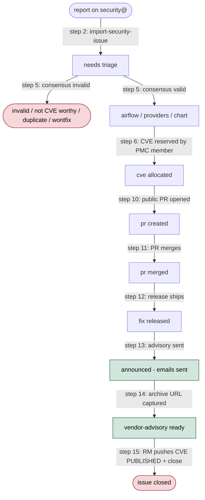

<!-- START doctoc generated TOC please keep comment here to allow auto update -->
<!-- DON'T EDIT THIS SECTION, INSTEAD RE-RUN doctoc TO UPDATE -->
**Table of Contents**  *generated with [DocToc](https://github.com/thlorenz/doctoc)*

- [Overview](#overview)
- [Who this guide is for](#who-this-guide-is-for)
- [Prerequisites for running the agent skills](#prerequisites-for-running-the-agent-skills)
  - [1. An agent that speaks the `SKILL.md` convention](#1-an-agent-that-speaks-the-skillmd-convention)
  - [2. Email connection (Gmail MCP, today)](#2-email-connection-gmail-mcp-today)
  - [3. GitHub connection (GitHub MCP / `gh` CLI)](#3-github-connection-github-mcp--gh-cli)
  - [4. PMC membership (only for CVE allocation)](#4-pmc-membership-only-for-cve-allocation)
  - [5. Browser (for the human-click steps)](#5-browser-for-the-human-click-steps)
  - [6. Local `apache/airflow` clone (only for `fix-security-issue`)](#6-local-apacheairflow-clone-only-for-fix-security-issue)
  - [7. `uv` (for `generate-cve-json`)](#7-uv-for-generate-cve-json)
- [Shared conventions](#shared-conventions)
  - [Keeping the reporter informed](#keeping-the-reporter-informed)
  - [Recording status transitions on the tracker](#recording-status-transitions-on-the-tracker)
  - [Confidentiality](#confidentiality)
- [For issue triagers — Steps 1–6](#for-issue-triagers--steps-16)
  - [Daily triage loop](#daily-triage-loop)
  - [Assessing a report](#assessing-a-report)
  - [Allocating the CVE](#allocating-the-cve)
  - [Tools you use most](#tools-you-use-most)
- [For remediation developers — Steps 7–11](#for-remediation-developers--steps-711)
  - [Picking up a tracker](#picking-up-a-tracker)
  - [Attempting an automated fix](#attempting-an-automated-fix)
  - [Opening the public fix PR manually](#opening-the-public-fix-pr-manually)
  - [Private-PR fallback](#private-pr-fallback)
  - [Handoff to the release manager](#handoff-to-the-release-manager)
  - [Tools you use most](#tools-you-use-most-1)
- [For release managers — Steps 12–15](#for-release-managers--steps-1215)
  - [Handoff from the remediation developer](#handoff-from-the-remediation-developer)
  - [Sending the advisory](#sending-the-advisory)
  - [Capturing the public archive URL](#capturing-the-public-archive-url)
  - [Publishing the CVE and closing the issue](#publishing-the-cve-and-closing-the-issue)
  - [Post-release credit corrections](#post-release-credit-corrections)
  - [Tools you use most](#tools-you-use-most-2)
- [Process reference: the 16 steps](#process-reference-the-16-steps)
  - [Step 1 — Report arrives on security@](#step-1--report-arrives-on-security)
  - [Step 2 — Import the report](#step-2--import-the-report)
  - [Step 3 — Discuss CVE-worthiness](#step-3--discuss-cve-worthiness)
  - [Step 4 — Escalate stalled discussions](#step-4--escalate-stalled-discussions)
  - [Step 5 — Land the valid/invalid consensus](#step-5--land-the-validinvalid-consensus)
  - [Step 6 — Allocate the CVE](#step-6--allocate-the-cve)
  - [Step 7 — Self-assign and implement the fix](#step-7--self-assign-and-implement-the-fix)
  - [Step 8 — Open a public PR (straightforward cases)](#step-8--open-a-public-pr-straightforward-cases)
  - [Step 9 — Open a private PR (exceptional cases)](#step-9--open-a-private-pr-exceptional-cases)
  - [Step 10 — Link the PR and apply `pr created`](#step-10--link-the-pr-and-apply-pr-created)
  - [Step 11 — PR merged](#step-11--pr-merged)
  - [Step 12 — Fix released](#step-12--fix-released)
  - [Step 13 — Send the advisory](#step-13--send-the-advisory)
  - [Step 14 — Capture the public advisory URL](#step-14--capture-the-public-advisory-url)
  - [Step 15 — Publish the CVE record and close the issue](#step-15--publish-the-cve-record-and-close-the-issue)
  - [Step 16 — Credit corrections](#step-16--credit-corrections)
- [Label lifecycle](#label-lifecycle)
  - [State diagram](#state-diagram)
  - [Label reference](#label-reference)

<!-- END doctoc generated TOC please keep comment here to allow auto update -->

## Overview

This private `airflow-s/airflow-s` repository is the security team's shared
tracker for Apache Airflow vulnerability reports. Only members of the security
team have access. Issues are created from reports raised on
`security@airflow.apache.org` and copied here by security-team members — the
GitHub author of a tracker is therefore **not always the reporter**, and the
real reporter is whoever sent the original email.

Every tracker flows through two channels at the same time:

- the original `security@airflow.apache.org` mail thread, where the reporter is
  kept informed at every status transition;
- a comment on the tracking issue, so the rest of the security team and the
  release manager can follow along without reconstructing state from labels
  and timestamps.

The rest of this document is organised by audience. Pick the role that matches
what you are about to do, read its section, and jump into the
[process reference](#process-reference-the-16-steps) when you need the
step-level detail.

## Who this guide is for

Three roles share the handling process. Any security-team member can take on
any of them for a given issue, and in practice people rotate — but at any
moment a given tracking issue has exactly one person who owns the next move.

Pick whichever applies to you now:

- **I am new to the security team, or I mostly just want to comment on
  issues.** Read [Shared conventions](#shared-conventions) below. The board at
  <https://github.com/orgs/airflow-s/projects/2> is the main view. You do not
  need an agent for commenting.
- **I am a rotational triager** — running `import new reports` and
  `sync all` a few times a week. Jump to
  [For issue triagers — Steps 1–6](#for-issue-triagers--steps-16).
- **I picked up a tracker and am about to open a fix PR.** Jump to
  [For remediation developers — Steps 7–11](#for-remediation-developers--steps-711).
- **I am the release manager for a cut containing a security fix.** Jump to
  [For release managers — Steps 12–15](#for-release-managers--steps-1215).
- **I am looking up a specific step or label.** Go straight to
  [Process reference](#process-reference-the-16-steps) or
  [Label lifecycle](#label-lifecycle).

## Prerequisites for running the agent skills

If you only plan to **comment on issues** from the board, skip this
section — a browser and your `airflow-s/airflow-s` collaborator access
are enough.

If you plan to **run any of the agent skills** (`import`, `sync`,
`allocate-cve`, `fix`, `generate-cve-json`, `deduplicate`) — typically
as a rotational triager, remediation developer, or release manager —
check the following setup **before** invoking a skill. Each skill also
runs a short Step 0 pre-flight against the same list and stops with a
clear message if something is missing, so you do not discover a
missing piece half-way through a workflow.

### 1. An agent that speaks the `SKILL.md` convention

[Claude Code](https://www.anthropic.com/claude-code) is the reference
implementation the skills are written against. Any agent that reads
the `.claude/skills/*/SKILL.md` files and follows their step-by-step
instructions should work; there is no hard dependency on Claude Code
specifically.

### 2. Email connection (Gmail MCP, today)

The import, sync, and allocate-cve skills **read the security@ mail
thread** associated with each tracker and draft replies on that
thread. Today this goes through the
[Claude Gmail MCP](https://docs.anthropic.com/en/docs/build-with-claude/mcp)
connected to the personal Gmail account of a security-team member who
is subscribed to `security@airflow.apache.org`. That is enough access
for the skills to see inbound reports and create drafts on the right
threads.

There is an ASF-wide alternative on the horizon:
[`rbowen/ponymail-mcp`](https://github.com/rbowen/ponymail-mcp) (by
Rich Bowen, former ASF board director and ComDev lead) now supports
OAuth authentication and can read private ASF lists. Once ASF OAuth
is wired in, individual triagers should be able to run the skills
without connecting their personal Gmail — authenticating directly
against ASF credentials (and, eventually, the ASF's new MFA) will be
sufficient. Until then, Gmail MCP is the way.

**Without this connection:** `import-security-issue` cannot find new
reports, `sync-security-issue` cannot reconcile status with the mail
thread, and no skill can draft replies to reporters. The skills will
refuse to start and tell you to configure the MCP first.

### 3. GitHub connection (GitHub MCP / `gh` CLI)

Every skill reads and writes `airflow-s/airflow-s` issues. Claude
Code ships with the GitHub MCP by default, and the skills also use
the `gh` CLI directly for some calls. What the skills need:

- Authenticated `gh auth status` on the shell the agent runs in.
- Collaborator access (any permission level) on
  `airflow-s/airflow-s` — see
  [Security team roster](AGENTS.md#security-team-roster).
- For `fix-security-issue`: a fork of `apache/airflow` on your
  GitHub account (the skill pushes a branch there before opening
  the PR via `gh pr create --web`).

### 4. PMC membership (only for CVE allocation)

The ASF Vulnogram form at
<https://cveprocess.apache.org/allocatecve> is **PMC-gated** on the
server side — only Airflow PMC members can submit a CVE allocation.
Non-PMC triagers can still run `allocate-cve`; the skill detects
this up front (it asks *"are you an Airflow PMC member?"*) and
produces a relay message for a PMC member to click through instead.

The same PMC gate applies to ponymail URL lookups on private ASF
lists; until `ponymail-mcp` is wired in with ASF OAuth, only PMC
members can see private-list archives directly.

### 5. Browser (for the human-click steps)

Several parts of the process involve a form a human has to fill in
and click — the Vulnogram allocation form, the Vulnogram `#source`
paste, the `gh pr create --web` compose view. The skills prepare
the URL and the exact text to paste and hand it off to the browser;
they do not try to automate those clicks.

### 6. Local `apache/airflow` clone (only for `fix-security-issue`)

The fix skill writes the change in your local clone, runs local
checks and tests, pushes a branch to your fork, and opens a PR via
`gh pr create --web`. You need:

- a clean clone of `apache/airflow` reachable from the agent's
  working directory;
- the Airflow dev toolchain — `uv`, Python 3.x, `breeze` if the
  change touches the parts of the repo that need it — installed
  per
  [`apache/airflow/contributing-docs`](https://github.com/apache/airflow/blob/main/contributing-docs/README.md);
- a remote named for your GitHub fork that `gh pr create` can push
  to.

### 7. `uv` (for `generate-cve-json`)

The `generate-cve-json` script is a small `uv`-managed Python
project. Install `uv` once
(<https://github.com/astral-sh/uv>); the script bootstraps the
rest.

## Shared conventions

These conventions bind every role. If you are unsure whether a rule applies to
you, it does.

### Keeping the reporter informed

The security team commits to keeping the original reporter informed about the
state of their report **at every status transition**, on the original mail
thread (not on the GitHub-notifications mirror thread). A short status update
should be sent to the reporter whenever any of the following happens:

* the report has been acknowledged or assessed (valid / invalid);
* a CVE has been allocated;
* a fix PR has been opened;
* a fix PR has been **merged**;
* the issue has been scheduled for a specific release (milestone set);
* the release has shipped and the public advisory has been sent;
* any credits or fields visible in the eventual public advisory have changed.

Each status update should plainly state what has changed, link to the relevant
artifact (PR URL, CVE ID, advisory link), and state what comes next. If the
reporter has not yet replied with their preferred credit, ask the
credit-preference question — but **do not re-ask it if it has already been
asked** on the same thread and is still awaiting a reply. Pinging the reporter
twice about the same open question is rude and gets us blocklisted; default to
the reporter's full name from the original email if they do not respond
before publication.

Reusable wording for the common cases lives in
[`canned-responses.md`](canned-responses.md) — consult it before drafting a
reply from scratch.

### Recording status transitions on the tracker

**Every status transition must also be recorded as a comment on the GitHub
issue in `airflow-s/airflow-s`**, not only sent by email. The two channels
serve different audiences: the email keeps the reporter informed; the issue
comment keeps the rest of the security team and the release manager informed
without forcing them to reconstruct the state from labels and timestamps. The
comment should briefly state what changed, link to the artifact (PR URL, CVE
ID, advisory link), and indicate whether the reporter has been notified.

### Confidentiality

The existence of `airflow-s/airflow-s`, the issue numbers it contains, the
labels we use, and everything discussed inside are **not public**. Nothing
from this repository may appear in public `apache/airflow` PR descriptions or
commits, public mailing-list posts, canned responses, or anywhere else a
non-security-team reader could see it.

The full rule set — including what is allowed in private `security@` /
`private@` threads, in status updates to the reporter, and in ``gh issue
comment`` calls inside this repository — lives in
[`AGENTS.md` — Confidentiality of `airflow-s/airflow-s`](AGENTS.md#confidentiality-of-airflow-sairflow-s).
Read it before editing anything that might be seen outside the team.

## For issue triagers — Steps 1–6

You own the tracker from an inbound report on `security@airflow.apache.org`
through to a CVE allocated, a scope label applied, and the issue ready for a
remediation developer to pick up. Step 6 (the CVE allocation itself) is
PMC-gated: **only Airflow PMC members can submit the Vulnogram allocation
form**. If you are not on the PMC you relay a pre-drafted request to a PMC
member — either way you are the one who lands the resulting CVE ID back into
the tracker.

### Daily triage loop

A typical triage sweep runs three skills in order:

1. **`import new reports`** —
   [`import-security-issue`](.claude/skills/import-security-issue/SKILL.md)
   scans `security@airflow.apache.org` for threads not yet imported,
   classifies each candidate (real report vs. automated-scan / consolidated /
   media / spam), and proposes a tracker per valid report plus a
   receipt-of-confirmation Gmail draft. See
   [Step 2](#step-2--import-the-report).
2. **`sync all`** —
   [`sync-security-issue`](.claude/skills/sync-security-issue/SKILL.md)
   reconciles every open tracker against its mail thread, the fix PR, the
   release train, and the users@ archive. Proposes label / milestone /
   assignee / body changes in one pass.
3. **`allocate CVE for issue #N`** —
   [`allocate-cve`](.claude/skills/allocate-cve/SKILL.md) when a report has
   been assessed as valid. See [Step 6](#step-6--allocate-the-cve).

Nothing is applied without an explicit confirmation — each skill is a
proposal engine, not an auto-pilot.

### Assessing a report

For each `needs triage` tracker, drive the validity assessment in comments,
pulling at least one other security-team member into the discussion. Use the
canned-response templates from [`canned-responses.md`](canned-responses.md)
for negative assessments so the tone stays polite-but-firm.

When the report is confirmed valid, apply exactly one scope label (`airflow`
/ `providers` / `chart`). If a report affects more than one scope, split into
per-scope trackers before allocation — the `sync-security-issue` skill
surfaces this as a blocker. See
[Step 5](#step-5--land-the-validinvalid-consensus).

If discussion stalls for about 30 days, escalate to a broader audience per
[Step 4](#step-4--escalate-stalled-discussions).

### Allocating the CVE

Use [`allocate-cve`](.claude/skills/allocate-cve/SKILL.md). The skill asks up
front whether you are on the PMC; if not, it reshapes the recipe into an
``@``-mention relay message you forward to a PMC member on the tracker or on
the `security@airflow.apache.org` thread. Once the allocated `CVE-YYYY-NNNNN`
is pasted back, the skill wires it into the tracker in one pass (the *CVE
tool link* body field, the `cve allocated` label, a status-change comment, a
refreshed CVE-JSON attachment) and hands off to `sync-security-issue` to
reconcile the rest of the tracker. See [Step 6](#step-6--allocate-the-cve)
for the full detail.

### Tools you use most

- [`import-security-issue`](.claude/skills/import-security-issue/SKILL.md) —
  *"import new reports"* at the start of each triage sweep. The entry point
  into the process.
- [`sync-security-issue`](.claude/skills/sync-security-issue/SKILL.md) —
  *"sync <issue-ref>"* or *"sync all"*. Surfaces stalled issues, missing
  fields, credit replies, and scope-split requirements in one combined
  proposal.
- [`allocate-cve`](.claude/skills/allocate-cve/SKILL.md) — *"allocate a CVE
  for <issue-ref>"*.
- [`generate-cve-json`](.claude/skills/generate-cve-json/SKILL.md) — to
  refresh the paste-ready JSON embedded in the issue body on demand.
- [`deduplicate-security-issue`](.claude/skills/deduplicate-security-issue/SKILL.md) —
  when two trackers describe the same root-cause bug discovered
  independently.

## For remediation developers — Steps 7–11

You own the tracker from a CVE allocated to a merged public fix PR in
`apache/airflow` (including the `pr merged` hand-off where the tracker sits
waiting for the release train to ship). The role name matches the
`remediation developer` credit you receive in the published CVE record (see
`credits[]` with `type: "remediation developer"` in the generated CVE JSON).

### Picking up a tracker

Pick a tracker that has a scope label, `cve allocated`, and clear consensus
on the fix shape. Self-assign yourself on GitHub so the board reflects
ownership. See [Step 7](#step-7--self-assign-and-implement-the-fix).

### Attempting an automated fix

Before writing the fix by hand, consider letting the
[`fix-security-issue`](.claude/skills/fix-security-issue/SKILL.md) skill try
it first. Invoked as *"try to fix issue #N"* (or *"draft a PR for #N"*), the
skill:

- runs `sync-security-issue` first to make sure the tracker's state is
  current;
- reads the full tracker discussion and the linked `security@` mail
  thread and decides whether the issue is *easily fixable* — clear
  consensus on the fix shape, small scope, known location in
  `apache/airflow`. If it is not, the skill stops and tells you what
  more the tracker needs before it is safe to attempt;
- if it is, proposes an implementation plan (which file(s) to touch,
  what to change, what tests to add) and **waits for your explicit
  confirmation** before making any edits;
- writes the change in your local `apache/airflow` clone, runs the
  local static checks and tests, and iterates on failures;
- opens the public PR from your fork via `gh pr create --web` with a
  scrubbed title and body — every public surface (commit message,
  branch name, PR title, PR body, newsfragment) is grep-checked for
  `CVE-`, `airflow-s`, `vulnerability`, *"security fix"* and similar
  leakage before being written or pushed;
- updates the `airflow-s/airflow-s` tracking issue with the new PR
  link and applies the `pr created` label, handing back off to
  `sync-security-issue`.

The skill refuses to proceed in cases where a human decision still
needs to happen: reports that are still being assessed, reports not
yet classified as valid vulnerabilities, and changes that require the
private-PR fallback in
[Step 9](#step-9--open-a-private-pr-exceptional-cases). If it refuses,
fall back to the manual flow below.

Even when the skill succeeds end-to-end, you remain the PR's author
and reviewer-facing contact on the public `apache/airflow` PR. Stay
on the PR through review and merge.

### Opening the public fix PR manually

If you are writing the fix by hand, write the code change in your local
`apache/airflow` clone, run the local checks and tests, and open the PR
via `gh pr create --web`. The PR description **must not** reveal the CVE,
the security nature of the change, or link back to `airflow-s/airflow-s` —
see [Step 8](#step-8--open-a-public-pr-straightforward-cases) and the
confidentiality rules in
[`AGENTS.md`](AGENTS.md#confidentiality-of-airflow-sairflow-s).

Request a `backport-to-v3-2-test` (or equivalent) label on the public PR
when the fix should ship on a patch train.

### Private-PR fallback

In exceptional cases — highly critical fixes, or code that needs private
review — open the PR against the `main` branch of `airflow-s/airflow-s`
instead of `apache/airflow`. CI does not run there, so run static checks and
tests manually before asking for review. Once approved, re-open the PR in
`apache/airflow` by pushing the branch public. See
[Step 9](#step-9--open-a-private-pr-exceptional-cases).

### Handoff to the release manager

Once the `apache/airflow` PR merges, `sync-security-issue` moves the tracker
from `pr created` to `pr merged` and sets the milestone of the release the
fix will ship in. The tracker then waits for the release train. When the
release ships, sync swaps `pr merged` → `fix released` and the tracker
becomes the release manager's responsibility. See
[Step 11](#step-11--pr-merged) and [Step 12](#step-12--fix-released).

### Tools you use most

- [`fix-security-issue`](.claude/skills/fix-security-issue/SKILL.md) —
  *"try to fix issue #N"*. Proposes a plan, writes the code, runs local
  tests, and opens a `--web` PR with a scrubbed title/body. See
  [Attempting an automated fix](#attempting-an-automated-fix) above for
  the full flow and the cases where the skill refuses to proceed.
- [`sync-security-issue`](.claude/skills/sync-security-issue/SKILL.md) — to
  keep the tracker's labels, milestone, and assignee aligned with the PR
  state as it moves through review and merge.

## For release managers — Steps 12–15

You own the tracker from the moment the fix actually ships (`fix released`)
to a closed tracking issue with a PUBLISHED CVE record. The hand-off from
the remediation developer is automatic: `sync-security-issue` detects the
milestone version on PyPI / the Helm registry, swaps `pr merged` →
`fix released`, and assigns the advisory-send to you.

### Handoff from the remediation developer

Watch your `fix released` queue on the board. Until the `pr merged` →
`fix released` swap fires, the tracker is still the remediation developer's
(Step 11 territory). Once it fires, it is yours. See
[Step 12](#step-12--fix-released).

### Sending the advisory

Review the attached CVE JSON on the tracker, fill any missing body fields
(CWE, severity, affected versions), and send the advisory emails to
`announce@apache.org` / `users@airflow.apache.org` from the ASF CVE tool.
Add `announced - emails sent` and remove `fix released`. **Do not close the
issue yet** — see [Step 13](#step-13--send-the-advisory).

### Capturing the public archive URL

This is a handoff the sync skill handles for you: once the advisory has
been archived on the users@ list, the next `sync-security-issue` run finds
the URL, populates the *Public advisory URL* body field, regenerates the
CVE JSON attachment, and moves the label to `vendor-advisory ready`. See
[Step 14](#step-14--capture-the-public-advisory-url).

### Publishing the CVE and closing the issue

For every `vendor-advisory ready` issue: open Vulnogram at
`https://cveprocess.apache.org/cve5/<CVE-ID>#source`, paste the latest
attached CVE JSON, save, and move the record from REVIEW to PUBLISHED.
Then close the issue (do not update any labels). This is the terminal
step of the lifecycle. See
[Step 15](#step-15--publish-the-cve-record-and-close-the-issue).

An issue that sits on `vendor-advisory ready` for more than a day or two
is a signal to ping the RM.

### Post-release credit corrections

If credits need correction after announcement, respond to the announcement
emails with the missing credits, update the ASF CVE tool, and ask the ASF
security team to push the information to `cve.org`. See
[Step 16](#step-16--credit-corrections).

### Tools you use most

- [`sync-security-issue`](.claude/skills/sync-security-issue/SKILL.md) —
  *"sync vendor-advisory ready"* at the start of each release window, to
  see the `vendor-advisory ready` backlog needing a Vulnogram push. Also
  *"sync CVE-YYYY-NNNN"* to drill into one specific CVE before sending the
  advisory.
- [`generate-cve-json`](.claude/skills/generate-cve-json/SKILL.md) — to
  regenerate the attachment on demand when a body field changes after the
  URL has been captured.

## Process reference: the 16 steps

This is the authoritative step-by-step description of the lifecycle. Each
role section above points into specific steps. If something in the role
sections conflicts with what is here, the reference wins.

### Step 1 — Report arrives on security@

The reporter reports the issue to `security@airflow.apache.org` or
`security@apache.org` (in the latter case, the security team of the Apache
Software Foundation will forward the issue to the Airflow security mailing
list).

### Step 2 — Import the report

**Import the report into `airflow-s/airflow-s` as a tracking issue.** The
[`import-security-issue`](.claude/skills/import-security-issue/SKILL.md)
skill is the on-ramp of the process: it scans `security@airflow.apache.org`
for threads that have not yet been imported, classifies each candidate
(real report vs. automated-scan / consolidated / media / spam), extracts
the issue-template fields from the root message, and proposes one tracker
per valid report plus a receipt-of-confirmation Gmail draft for each.
Nothing is applied without explicit user confirmation. A security team
member runs the skill (*"import new reports"*) as the first action of a
triage sweep; the newly-created issue lands with the `needs triage` label
set automatically by the issue template, and the draft reply is ready in
Gmail for the triager to review and send.

If the report is "obviously invalid" (we've seen such issues before and
triaged or responded to them) — for example an automated-scanner dump or a
consolidated multi-issue report — the skill proposes the matching canned
response from [`canned-responses.md`](canned-responses.md) as a Gmail draft
and does **not** create a tracker, so the invalid class never enters the
board.

The tracker still has no scope label at this point — that is applied at
Step 5 when validity is confirmed.

### Step 3 — Discuss CVE-worthiness

In the issue, we discuss and agree on whether it is worth having a CVE for
it.

### Step 4 — Escalate stalled discussions

If the discussion stalls and we cannot make a decision in about 30 days,
the next step is to seek assistance in making a decision from a broader
audience:

* `private@airflow.apache.org`
* `security@apache.org`
* the reporter(s) who raised the issue, asking them for their opinion and
  additional context

Such a discussion should include additional context — a digest of the
discussion so far, the options considered, the impact, pros and cons, and
so on. This can help to get additional perspectives and possibly better
ideas.

### Step 5 — Land the valid/invalid consensus

Finally, if we cannot reach consensus we follow
[voting](https://www.apache.org/foundation/voting.html#apache-voting-process).
A vote on code modification is used, which means that committers have
binding votes, whereas everyone else has advisory votes — and all are
encouraged to vote and express their opinion. If there is no major
disagreement during the discussion, there is no need to formally vote via
a mailing list thread — the voting is done in the PR. However, if there
are differing opinions, voting is done on the `security@airflow.apache.org`
list. The `needs triage` label should then be removed.

### Step 6 — Allocate the CVE

If we agree the issue is invalid, a team member closes the issue and
responds to the reporter with that information. If the issue is valid,
**an Airflow PMC member**
[assigns a CVE via the ASF CVE tool](https://cveprocess.apache.org/allocatecve).
The Vulnogram allocation button is PMC-gated on the server side, so a
triager who is not on the PMC cannot complete the allocation themselves —
they prepare the request (using the
[`allocate-cve`](.claude/skills/allocate-cve/SKILL.md) skill, which strips
the redundant `Apache Airflow` prefix from the title and builds a relay
message) and forward it to a PMC member via an ``@``-mention on the
tracker or on the `security@airflow.apache.org` thread. Once the PMC
member has allocated and reported the `CVE-YYYY-NNNNN` back, the skill
can be re-invoked with the ID as an override to wire the allocated CVE
into the tracker: the *CVE tool link* body field, the `cve allocated`
label, a status-change comment, and a refreshed CVE-JSON body embed. The
skill then hands off to `sync-security-issue` to reconcile the rest of
the tracker (milestone, assignee, fix-PR state, reporter-thread drafts)
in the same flow.

The team member (triager or PMC, whoever has the reporter's thread
loaded) then responds in the email thread to confirm creation of the CVE
to the reporter, including the CVE ID, asks the reporter how they would
like to be credited, and updates the reporter name in the issue
description when the reporter answers.

### Step 7 — Self-assign and implement the fix

One of the team members self-assigns the issue (not necessarily the
person who originally started the discussion) and implements the fix.

NOTE: In some cases it is possible to delegate the fix to a trusted
third-party individual. For example, if the security team member assigned
to the issue has access to developers willing or otherwise dedicated to
Airflow development, they may delegate to one such individual, provided
that:

1) The individual is trusted.
2) The individual only receives the information required to implement a
   fix (no wholesale sharing of security team emails, GitHub issues,
   etc.).
3) A LAZY CONSENSUS vote is conducted in either the email thread or the
   GitHub issue associated with the security issue (GitHub communications
   are synced to the email group for posterity).

### Step 8 — Open a public PR (straightforward cases)

If the issue is straightforward, it may be followed by a direct PR in the
Airflow repository. The description in the PR should not reveal the CVE
or the security nature of it.

### Step 9 — Open a private PR (exceptional cases)

In exceptional cases — when the issue is highly critical, or when code
discussion is needed and the PR requires input and review before it gets
merged — the person solving it can create a PR in the `airflow-s/airflow-s`
repository with "Closes: #issue". The PR should be raised against the
`main` branch of the `airflow-s/airflow-s` repository (not the default
`airflow-s` branch). This allows for detailed code-change discussion in
private. For now, CI is not run for PRs in the `airflow-s/airflow-s`
repository, so static checks and tests should be run manually by the
person creating the PR. We may improve this in the future. Once the PR
has been reviewed, approved, and is ready to merge, the branch with the
fix should be pushed to the Airflow repository and the PR should be
re-opened in the Airflow repository by pushing the branch to public
`apache/airflow` and merging it there.

### Step 10 — Link the PR and apply `pr created`

Once the PR is created in the `apache/airflow` repository, the team
member who creates it should link to the PR in the description of the
issue and mark the issue with the `pr created` label in `airflow-s`.

### Step 11 — PR merged

**PR merged.** When the `apache/airflow` PR merges, the security team
member merging it should move the issue from `pr created` to `pr merged`.
If there is a private variant of the PR in the `airflow-s/airflow-s`
repository, it should be closed. The milestone of the issue should be set
to the milestone when it is planned to be released. Milestones follow
these formats:

* **`Airflow-X.Y.Z`** — core Airflow releases (e.g. `Airflow-2.6.2`, `3.2.2`).
* **`Providers YYYY-MM-DD`** — provider-wave cuts, keyed by the cut date
  listed on the
  [Release Plan wiki](https://cwiki.apache.org/confluence/display/AIRFLOW/Release+Plan).
  The cut date, not the publish date on PyPI, is used as the milestone
  title.
* **`Chart-X.Y.Z`** — Airflow Helm Chart releases (e.g. `Chart-1.9.0`).

New milestones are created when needed. The `sync-security-issue` skill
will create a missing provider-wave milestone via `gh api` and assign the
issue to it in the same proposal. Sometimes, as a result of the triage
discussions, the fix should not be applied in the next patch-level
release — for example, because of high risk involved or because it needs
to be correlated with other changes. In such cases, the milestone in the
issue and the corresponding PR should be set to the next minor release
rather than the next patch-level release.

**The issue stays at `pr merged` until the release containing the fix
actually ships.** That may be hours (for core patch releases cut on a
fast cadence) or weeks (for providers waves on a fixed monthly schedule).
During that window the issue is waiting on the release train, not on any
action from the security team — the next transition fires automatically
when the release hits PyPI / the Helm registry (Step 12).

### Step 12 — Fix released

**Fix released.** When the release carrying the fix actually ships to
users — the final `apache/airflow` / `apache-airflow-providers-*` /
`apache-airflow-helm-chart-*` version is live on PyPI or on the Helm
registry — the issue moves from `pr merged` to `fix released`. The
`sync-security-issue` skill detects the release (by curling PyPI / the
Helm registry for the milestone version) and proposes the label swap on
the next run, so in practice this transition is automatic; a security
team member only needs to confirm the sync proposal.

**Why this is its own step.** The `pr merged` → `fix released` swap is
the cue that ownership of the issue has transferred from the fix author /
triager to the **release manager** for that release. Before
`fix released`, the issue is a code-change artifact; after `fix released`,
it is an advisory-coordination artifact and the release manager is
responsible for steps 13–15 below. Combining the two into one step made
this ownership hand-off implicit; splitting them makes it explicit and
surfaces a `fix released` backlog the release manager can drive from the
board.

### Step 13 — Send the advisory

During releases, the release manager looks through `fix released` issues
in `airflow-s`, updates the [ASF CVE tool](https://cveprocess.apache.org),
and updates the following fields, taking them from the issue:

* CWE (Common Weakness Enumeration) — possible CWEs are available
  [here](https://cwe.mitre.org/data/index.html)
* Product name (Airflow, affected Airflow Provider, or Airflow Helm Chart)
* Version affected (`0, < Version released`)
* Short public summary
* Severity score — based on the
  [Severity Rating blog post](https://security.apache.org/blog/severityrating).
  The issue owner should, during discussion on the issue, propose the
  score and update the ticket. In obvious cases with no objections, this
  should work in lazy-consensus mode. If there are differing opinions,
  driving the discussion to achieve consensus is the preferred outcome.
  Voting may be cast if needed. If the severity has not been decided or
  consensus reached during earlier discussion, the Release Manager has
  the final say on the severity score (but should take into account the
  opinions of the security team). This is to prioritize getting the issue
  announcement out in a timely manner.
* References:
    * `patch` — PR to the fix in the Apache Airflow repository
* Credits:
    * `reporter` — reporter(s) of the issue
    * `remediation developer` — PR author(s)

The release manager also generates the CVE description, sets the CVE to
REVIEW if feedback is needed and then to READY, and eventually sends the
announcement emails from the ASF CVE tool. The release manager then adds
the `announced - emails sent` label and removes the `fix released` label.
**The issue stays open** at this point — it is closed only at Step 15
below, after the public archive URL has been captured (Step 14) and the
CVE record has been pushed to PUBLISHED in Vulnogram (Step 15). This
gives the `sync-security-issue` skill one more handoff where it can
notice a missing archive URL and prompt for it before the issue is
forgotten.

### Step 14 — Capture the public advisory URL

**Capture the public advisory URL and move the tracker to
`vendor-advisory ready`.** Once the announcement email has been delivered
and archived, this is done by the next `sync-security-issue` run (or the
release manager, if they want to drive it by hand):

* retrieves the archive URL from the
  [users@ list archive](https://lists.apache.org/list.html?users@airflow.apache.org) —
  the `sync-security-issue` skill scans the archive for the CVE ID on
  every run and proposes the URL automatically once it finds a match;
* pastes the URL into the tracking issue's **Public advisory URL** body
  field (the field was added to the issue template specifically for this
  handoff — never reuse the *"Security mailing list thread"* field, which
  holds the private `security@` thread);
* regenerates the CVE JSON attachment — `generate-cve-json` now picks up
  the URL from the body automatically and tags it as `vendor-advisory` in
  `references[]`, so the attached CVE record carries a resolvable
  `vendor-advisory` link ready to paste into the ASF CVE tool;
* **adds the `vendor-advisory ready` label** to the tracking issue. The
  issue **stays open** at this point — closing is the release manager's
  job in Step 15 below, after they have pushed the CVE record to PUBLISHED
  in Vulnogram.

Until the *Public advisory URL* field is populated, the
`sync-security-issue` skill will not propose moving the issue to
`vendor-advisory ready` — this is deliberate: the field is what the CVE
record's public `vendor-advisory` reference will point at, and publishing
a CVE with an empty reference leaks a broken record into `cve.org`.

### Step 15 — Publish the CVE record and close the issue

**Push the final CVE record and close the issue.** For every issue
carrying the `vendor-advisory ready` label, the release manager (the
same person who sent the advisory in Step 13):

* opens the Vulnogram `#source` tab at
  `https://cveprocess.apache.org/cve5/<CVE-ID>#source`;
* copies the latest CVE JSON attachment from the tracking issue (the one
  regenerated in Step 14, now carrying the `vendor-advisory` URL) and
  pastes it into the `#source` form;
* saves and moves the record from `REVIEW` to `PUBLISHED` in the ASF CVE
  tool — **this is the final action** that propagates the record to
  [`cve.org`](https://cve.org);
* **closes the issue** — do not update any labels. That closes
  the lifecycle.

This two-step hand-off (sync captures the URL → RM publishes the record)
means nobody has to remember both halves: the sync skill's responsibility
ends when the label is `vendor-advisory ready`, and the RM's
responsibility is scoped to taking a `vendor-advisory ready` issue to the
closed state. An issue that sits on `vendor-advisory ready` for more than
a day or two is a signal to ping the RM.

### Step 16 — Credit corrections

If we need to add missing credits (which sometimes happens due to
copy-and-paste errors and the brittleness of the process), the release
manager:

* responds to the announcement emails and mentions the missing credits
* updates the [ASF CVE tool](https://cveprocess.apache.org) with the
  missing credits
* asks the ASF security team to push the information to
  [cve.org](https://cve.org)

## Label lifecycle

### State diagram

The diagram below shows the typical state flow. Each node is a label (or a
cluster of labels that co-exist); each edge is a process step that moves
the issue forward. Closing dispositions (`invalid`, `not CVE worthy`,
`duplicate`, `wontfix`) can terminate the flow at any point after
`needs triage`.

### Label reference

The table below repeats the same flow in tabular form. An issue typically
moves through these labels left-to-right:

| Label | Meaning | Added at step | Removed at step |
| --- | --- | --- | --- |
| `needs triage` | Freshly filed; assessment not yet started. | 1 | 5 |
| `airflow` / `providers` / `chart` | Scope of the vulnerability. Exactly one of these is set. | 5 | never (sticks for the lifetime of the issue) |
| `cve allocated` | A CVE has been reserved for the issue. Allocation itself is PMC-gated (only Airflow PMC members can submit the Vulnogram allocation form); a non-PMC triager relays a request to a PMC member via the [`allocate-cve`](.claude/skills/allocate-cve/SKILL.md) skill. | 6 | never |
| `pr created` | A public fix PR has been opened in `apache/airflow` but has not yet merged. | 10 | 11 (replaced by `pr merged`) |
| `pr merged` | The fix PR has merged into `apache/airflow`; no release with the fix has shipped yet. | 11 | 12 (replaced by `fix released` when the release ships) |
| `fix released` | A release containing the fix has shipped to users; advisory has not been sent yet. | 12 | 13 (replaced by `announced - emails sent`) |
| `announced - emails sent` | The public advisory has been sent to `announce@apache.org` / `users@airflow.apache.org`. The issue **stays open** after this label is applied; closing is gated on the RM completing Step 15. | 13 | never (stays on the issue after closing for audit history) |
| `vendor-advisory ready` | The public advisory URL has been captured in the tracking issue's *Public advisory URL* body field and the attached CVE JSON has been regenerated so its `references[]` now carries the `vendor-advisory` URL. The tracking issue is waiting for the release manager to copy the CVE JSON into Vulnogram, move the record to PUBLISHED, and close the issue (Step 15). No label changes at close — the issue closes with `vendor-advisory ready` still set. | 14 | never (stays on the issue after closing) |
| `wontfix` / `invalid` / `not CVE worthy` / `duplicate` | Closing dispositions for reports that are not valid or not CVE-worthy. | 5 / 6 | — |

The [`sync-security-issue`](.claude/skills/sync-security-issue/SKILL.md)
skill keeps these labels honest: on every run it detects the current state
of the issue, the fix PR, and the release train, and proposes the label
transitions the process requires.
