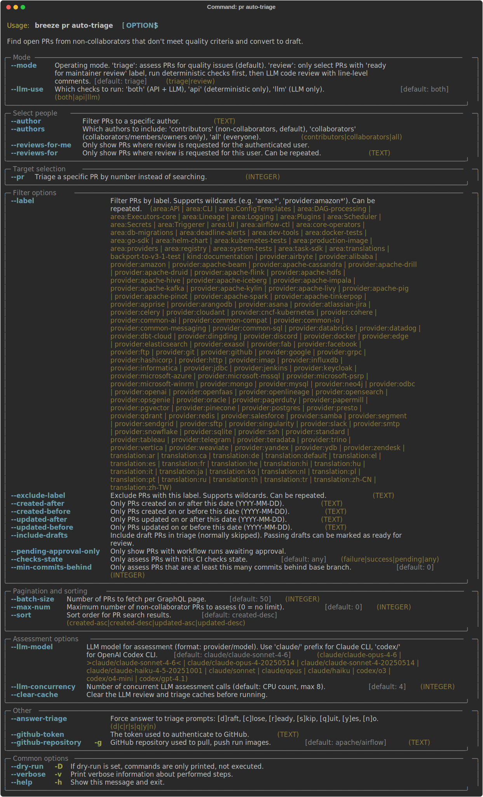

 .. Licensed to the Apache Software Foundation (ASF) under one
    or more contributor license agreements.  See the NOTICE file
    distributed with this work for additional information
    regarding copyright ownership.  The ASF licenses this file
    to you under the Apache License, Version 2.0 (the
    "License"); you may not use this file except in compliance
    with the License.  You may obtain a copy of the License at

 ..   http://www.apache.org/licenses/LICENSE-2.0

 .. Unless required by applicable law or agreed to in writing,
    software distributed under the License is distributed on an
    "AS IS" BASIS, WITHOUT WARRANTIES OR CONDITIONS OF ANY
    KIND, either express or implied.  See the License for the
    specific language governing permissions and limitations
    under the License.

Pull request tasks
------------------

There are Breeze commands that help maintainers manage GitHub pull requests for the Apache Airflow project.

Those are all of the available PR commands:

.. image:: ./images/output_pr.svg
  :target: https://raw.githubusercontent.com/apache/airflow/main/dev/breeze/doc/images/output_pr.svg
  :width: 100%
  :alt: Breeze PR commands

Auto-triaging PRs
"""""""""""""""""

The ``breeze pr auto-triage`` command finds open PRs from non-collaborators that don't meet
minimum quality criteria and lets maintainers take action on them interactively.

The command works in several phases:

1. **Fetch** — Fetches open, non-draft PRs via the GitHub GraphQL API.
2. **Filter** — Skips collaborators, bot accounts (dependabot, renovate, github-actions),
   and PRs already labeled ``ready for maintainer review``.
3. **Assess** — Runs deterministic checks (CI failures, merge conflicts, missing test
   workflows) and optionally LLM-based quality assessment (via ``claude`` or ``codex`` CLI).
4. **Triage** — Presents flagged PRs grouped by author. For each PR the maintainer chooses
   an action:

   * **[D]raft** — Convert to draft and post a comment listing the violations (default for
     most PRs).
   * **[C]lose** — Close the PR, add the ``closed because of multiple quality violations``
     label, and post a comment. This is the suggested default when the author has more than
     3 flagged PRs.
   * **[R]eady** — Add the ``ready for maintainer review`` label so the PR is skipped in
     future runs.
   * **[S]kip** — Take no action on this PR.
   * **[Q]uit** — Stop processing.

   The command computes a smart default action based on CI failures, merge conflicts, LLM
   assessment, and the number of flagged PRs by the same author. In ``--dry-run`` mode the
   default action is displayed without prompting.

5. **Workflow approval** — PRs with no test workflows run are presented for workflow
   approval. Before approving, the maintainer reviews the full PR diff to check for
   suspicious changes (e.g. attempts to exfiltrate secrets or modify CI pipelines). If
   suspicious changes are confirmed, **all open PRs by that author** are closed, labeled
   ``suspicious changes detected``, and commented.

Labels used by auto-triage
^^^^^^^^^^^^^^^^^^^^^^^^^^

The command uses the following GitHub labels to track triage state:

``ready for maintainer review``
   Applied when a maintainer chooses the **[R]eady** action on a flagged PR. PRs with this
   label are automatically skipped in future triage runs, indicating the maintainer has
   reviewed the flags and considers the PR acceptable for review.

``closed because of multiple quality violations``
   Applied when a maintainer chooses the **[C]lose** action. This label marks PRs that were
   closed because they did not meet quality criteria and the author had more than 3 flagged
   PRs open at the time. A comment listing the violations is posted on the PR.

``suspicious changes detected``
   Applied when a maintainer identifies suspicious changes (e.g. secret exfiltration attempts,
   malicious CI modifications) while reviewing a PR diff during the workflow approval phase.
   When this label is applied, **all open PRs by the same author** are closed and labeled,
   with a comment explaining the reason.

These labels must exist in the GitHub repository before using the command. If a label is
missing, the command will print a warning and skip the labeling step.

Example usage:

.. code-block:: bash

     # Dry run to see which PRs would be flagged and what action would be taken
     breeze pr auto-triage --dry-run

     # Run with CI checks only (no LLM)
     breeze pr auto-triage --check-mode ci

     # Filter by label and author
     breeze pr auto-triage --label area:core --author some-user

     # Limit to 10 PRs
     breeze pr auto-triage --max-num 10

     # Verbose mode — show individual skip reasons during filtering
     breeze pr auto-triage --verbose
